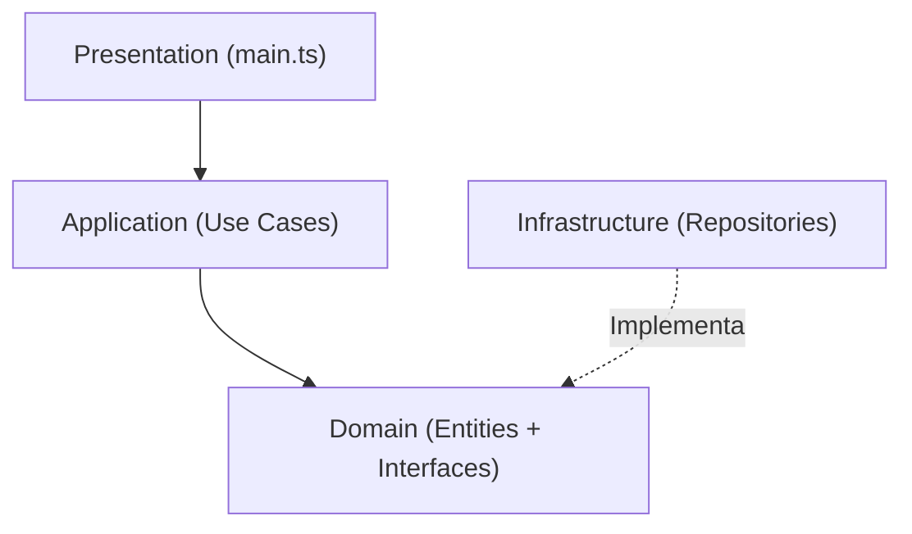

# CLEAN-ARCHITECTURE
# Sistema de Tienda - Clean Architecture en TypeScript

## Descripción del Proyecto

Este proyecto consiste en un sistema básico de tienda desarrollado en TypeScript utilizando el patrón arquitectónico **Clean Architecture**.

El sistema permite:

* Registrar productos.
* Registrar clientes.
* Realizar ventas.
* Consultar ventas realizadas.

El objetivo principal del proyecto es demostrar la aplicación de las cuatro capas de Clean Architecture y la correcta separación de responsabilidades entre ellas.

---

# Patrón Arquitectónico Utilizado

## Clean Architecture

Clean Architecture es un patrón propuesto por Robert C. Martin (Uncle Bob) que organiza el software en capas independientes.

Su principal objetivo es mantener el código desacoplado, fácil de mantener y escalable.

En esta arquitectura las dependencias siempre apuntan hacia el núcleo del sistema, que corresponde a la capa Domain.

---

# Estructura del Proyecto

```text
src
│
├── domain
│   ├── entities
│   │   ├── Product.ts
│   │   ├── Customer.ts
│   │   └── Sale.ts
│   │
│   └── repositories
│       ├── ProductRepository.ts
│       ├── CustomerRepository.ts
│       └── SaleRepository.ts
│
├── application
│   └── use-cases
│       ├── CreateProduct.ts
│       ├── CreateCustomer.ts
│       ├── RegisterSale.ts
│       └── GetSales.ts
│
├── infrastructure
│   └── repositories
│       ├── ProductRepositoryMemory.ts
│       ├── CustomerRepositoryMemory.ts
│       └── SaleRepositoryMemory.ts
│
└── presentation
    └── main.ts
```

---

# Aplicación de las Capas

## 1. Domain

La capa Domain representa el núcleo del sistema.

Contiene:

### Entidades

* Product
* Customer
* Sale

Estas entidades representan los objetos principales del negocio.

Además, contienen reglas de negocio como:

* Validación del precio del producto.
* Validación del stock disponible.
* Cálculo del total de una venta.
* Validación de cantidades vendidas.

### Repositorios

Los repositorios son interfaces que definen contratos para acceder a los datos.

Ejemplos:

* ProductRepository
* CustomerRepository
* SaleRepository

Estas interfaces permiten desacoplar la lógica de negocio de los mecanismos de almacenamiento.

---

## 2. Application

La capa Application contiene los casos de uso del sistema.

Cada caso de uso representa una acción que puede realizar el usuario.

### Casos de Uso Implementados

* CreateProduct
* CreateCustomer
* RegisterSale
* GetSales

Su responsabilidad es coordinar el flujo de la aplicación utilizando las entidades y repositorios definidos en Domain.

La lógica de negocio no se implementa aquí, sino dentro de las entidades del dominio.

---

## 3. Infrastructure

La capa Infrastructure implementa los contratos definidos en Domain.

En este proyecto se utilizaron repositorios en memoria:

* ProductRepositoryMemory
* CustomerRepositoryMemory
* SaleRepositoryMemory

Estos repositorios almacenan los datos en arreglos de TypeScript para simular una base de datos.

Gracias a esta separación, en el futuro podrían reemplazarse por una base de datos MySQL, PostgreSQL o MongoDB sin modificar las demás capas.

---

## 4. Presentation

La capa Presentation es el punto de entrada del sistema.

En este proyecto está representada por:

* main.ts

Su función es interactuar con el usuario y ejecutar los casos de uso correspondientes.

No contiene reglas de negocio ni acceso directo a los datos.

---

# Flujo de una Venta

1. El usuario solicita registrar una venta.
2. Presentation invoca el caso de uso RegisterSale.
3. RegisterSale obtiene el cliente y el producto.
4. Se crea una instancia de Sale.
5. La entidad Product valida el stock disponible.
6. La entidad Sale calcula el total de la venta.
7. Infrastructure almacena la venta.
8. Se devuelve el resultado al usuario.

---

# Diagrama de Dependencias



---

# Beneficios Obtenidos

* Separación clara de responsabilidades.
* Bajo acoplamiento entre capas.
* Mayor facilidad de mantenimiento.
* Posibilidad de cambiar la tecnología de almacenamiento sin afectar la lógica de negocio.
* Código más organizado y escalable.

---

# Conclusión

La implementación de Clean Architecture permitió organizar el sistema de tienda en capas independientes, separando la lógica de negocio, los casos de uso, la infraestructura y la presentación. Esta estructura facilita el mantenimiento del software y permite futuras ampliaciones sin afectar el núcleo de la aplicación.
